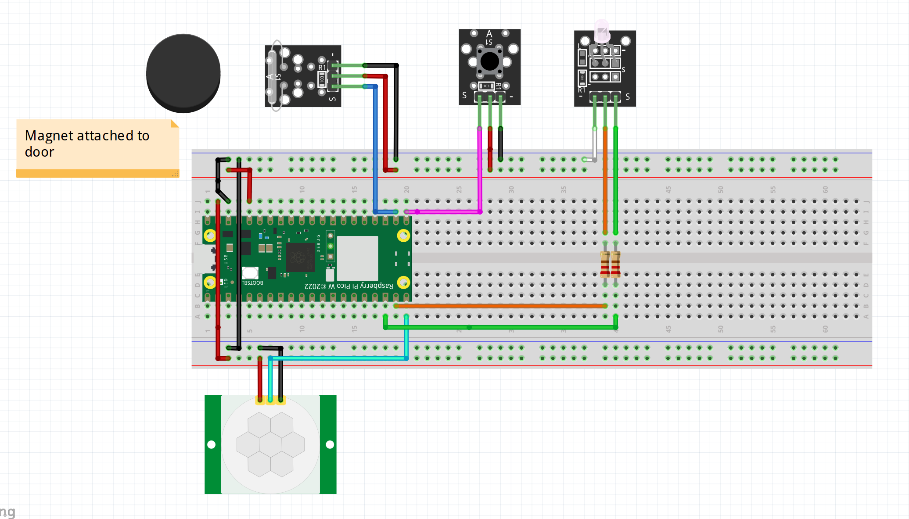
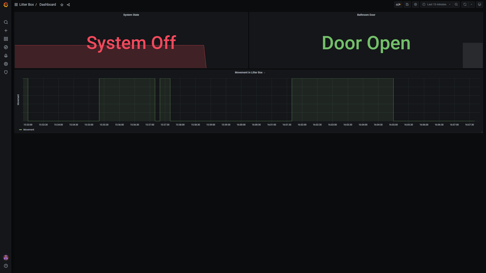

# Litter Box Monitor

Name: **Jonathan Frey**

Student Id: **jf223rf**

## Table of content

- [Table of content](#table-of-content)
- [Overview](#overview)
- [Objective](#objective)
- [Material](#material)
- [Computer setup](#computer-setup)
  - [Flashing the Firmware](#flashing-the-firmware)
  - [Installing VSCode and Pymakr Plugin)](#installing-vscode-and-pymakr-plugin)
  - [Install Required Software](#install-required-software)
- [Putting everything together](#putting-everything-together)
- [Platform](#platform)
- [The Code](#the-code)
- [Transmitting the data / connectivity](#transmitting-the-data--connectivity)
- [Presenting the data](#presenting-the-data)
- [Finalizing the design](#finalizing-the-design)
  - [Results](#results)
  - [Reflection](#reflection)

## Overview

In this project we will create a monitor for tracking movement in a litter box as well as the open or closed state of a nearby door(E.g. bathroom door). By doing this we can see the defecation and urination habits of the cat/cats and minimize the risk of the bathroom door being closed for too long, which may result in unneccessary stress in the cat and urination in unwanted locations.

Estimated time: **4 hours**

## Objective

In late 2023, one of my cats suffered from urinary obstruction due to bladder stones. This lead to him having to be admitted to the veterinary clinic. Luckily we caught it early and the recovery went great. However, the risk of the bladder stones coming back is always there, which is why I wanted to track when the cats use the litter box. By tracking when they use the bathroom, I can look for patterns and notice when something is wrong. Knowing the state of the bathroom door lets me know if the door accidentally has been left closed.

## Material

| **Item**                                                                                     | **Description**                                                                            |
| -------------------------------------------------------------------------------------------- | ------------------------------------------------------------------------------------------ |
| 1x Raspberry Pi Pico WH                      | Microcontroller for interfacing with sensors, running logic and communication over network |
| 1x HC-SR501 PIR Motion Sensor      | Digital motion sensor for detecting movement in litter box                                 |
| 1x KY-021 Reed Switch Module Mini  | digital sensor for detecting nearby magnetic fields                                        |
| 1x Neodynium Magnet                                                                          | For triggering reed sensor                                                                 |
| 1x KY-004 Push Button                        | For disabling sensor readings when cleaning litter box                                     |
| 1x KY-011 R/G LED module (5mm)         | For displaying if sensor readings are disabled or not                                      |
| 2x 330ohm Resistor                                                                           | for limiting the voltage to LED channels                                                   |
| Male-to-female and Male-to-male Wires                                                        | For connecting sensors and actuators to the microcontroller                                |
| micro-USB cable                                                                              | For providing power to the microcontroller                                                 |

In this tutorial these componentswill be used with the microcontroller mounted to a breadboard, but to move on from the prototyping stage, soldering wires directly to the components and putting them in casings is recommended.

The Pico WH comes with pins pre-soldered onto the board. A Pico W can be used instead, but will require you to solder the pins yourself.

## Computer Setup

### Flashing the Firmware

1. **Download the MicroPython firmware:**

   - Go to the official Raspberry Pi Pico MicroPython download page.

   - Download the latest UF2 file for the Raspberry Pi Pico W.

2. **Connect the Pico W to your computer**:

   - Hold down the BOOTSEL button on the Pico W and connect it to your computer via a USB cable. Release the BOOTSEL button after connecting.

3. **Flash the MicroPython firmware**:

   - The Pico W should appear as a mass storage device on your computer.

   - Drag and drop the downloaded UF2 file onto the Pico W's mass storage device. The device will reboot automatically and appear as a USB serial device.

### Installing VSCode and Pymakr Plugin

1. **Install Visual Studio Code (VSCode):**

   - Download and install VSCode from [here](https://code.visualstudio.com/).

2. **Install Pymakr Plugin:**

   - Open VSCode and go to the Extensions view by clicking the Extensions icon in the Activity Bar on the side of the window.

   - Search for "Pymakr" and click "Install" on the Pymakr plugin by Pycom.

3. **Configure Pymakr Plugin:**

   - After installing the Pymakr plugin, you need to configure it to communicate with your Pico W.

   - Click on the Pymakr icon on the VSCode status bar. At the bottom a list of identified devices can be seen.

   - Connect your Pico W to your computer while watching the list of devices. A new device will apear in the list. That is the Pico W.

   - Hover over the device and press "connect device".

   - To find it easierr in the future you can right-click the device and press "configure device"

   - Here you can both change the name of the device and configure Pymakr to automatically connect to the device when connected to the computer.

### Install Required Software

**1. Install Node.js:**

- Download and install Node.js from [here](https://nodejs.org/en).

- Node.js is required for some of the Pymakr functionalities.

**Step 4: Uploading Code to the Pico W**

**1. Create a new MicroPython project in VSCode:**

- Open VSCode and create a new folder for your project.

- Inside this folder, create a new Python file (e.g., main.py) and write your MicroPython code.

**2. Connect to the Pico W:**

- Ensure your Pico W is connected to your computer via USB.

- Click the Pymakr icon on the status bar and select "Connect".

**3. Upload the code:**

- Once connected, you can upload your code to the Pico W by clicking the Pymakr icon and selecting "sync project to device".

- The code will be transferred to the Pico W and run automatically.

- You may also start development mode, automatically uploading changed files to the device and restarting it.

## Putting Everything Together

Below is the schematic for the wiring of all the sensors and actuators. In a product environment, a breadboard should not be used and the wiring should be soldered directly to the microcontroller.



There are two rails connected to power from the microcontroller. The north one is powered by 3V3 (pin 36), and the sout one is powered by VBUS (Pin 40, 5v). 3V3 is used to power the reed switch and the push button. VBUS is used to power the PIR-sensor. The LED channels are powered by their respective GPIO pins.

- **LED:** Green channel connected on GPIO 13. Red channel connected son GPIO 14. Powered by their respective GPIO pins.

- **PIR-sensor:** Input signal connected on GPIO 15.

- **Push Button:** Output signal connected on GPIO 16.

- **Reed Switch:** Input signal connected on GPIO 17. Magnet mounted on bathroom door.

## Platform

**Overview:**

I have chosen the TIG-stack containerized using Docker for receiving, storing and visualizing data.

**TIG Stack:** TIG stands for Telegraf, InfluxDB, and Grafana. These three tools work together to collect, store, and visualize metrics.

**Telegraf:** A plugin-driven server agent for collecting and reporting metrics.
**InfluxDB:** A time-series database designed to handle high write and query loads.
**Grafana:** A powerful visualization tool for time-series data.

**Platform Chosen:** DigitalOcean

Why DigitalOcean? DigitalOcean provides a straightforward and cost-effective cloud platform that is easy to set up and manage. It is ideal for small to medium-sized projects and offers a good balance of performance and price. As a student I also receive $200 in credits that can be used to rent droplets (virtual machines).

If you don't want to rely on external services, you may instead host the TIG-stack docker containers on your personal computer. But this means data will only be collected while the computer is powered on and not in sleep mode. It will also not be accessible from other devices without extra setup such as receiving a permanent IP-adress.

**Functionality and Features:**

**Telegraf:**

- Used to collects metrics from the Pico W through a MQTT broker.

- writes the received data to the influxDB database.

**InfluxDB:**

- Optimized for time-series data, supporting high write and query throughput.

- Stores the received data with timestamps.

**Grafana:**

- Provides a rich set of visualization tools to create interactive and customizable dashboards from the data.

## The Code

The source code is seperated into several files.

`boot.py` executes when the system powers on and connects to the wifi as well as instantiating an instance of the the MQTT client that connects to the MQTT broker. The functionality for this is provided by the `wifiConnection.py` and `mqtt.py` files.

The `main.py` file executes next, and is, as the name hints at, the main file for the application. For each sensor/actuator, a seperate file has been created which contains a class encapsulating the core funtionalities for each sensor/actuator. In order for the main file to be able to read and reset the values getters and setters are created.

```python
class MotionSensor:
    def __init__(self, motion_sensor_pin, is_on_getter):
        self._start_time = utime.ticks_ms()
        self._motion_sensor = Pin(motion_sensor_pin, Pin.IN, Pin.PULL_UP)
        self._motion_sensor.irq(trigger=Pin.IRQ_RISING, handler=self._motion_sensor_handler)
        self.set_movement_detected(0)
        self._is_on_getter = is_on_getter

    # Define callback functions for each interrupt
    def _motion_sensor_handler(self, pin):
        if self.get_movement_detected() == 1:
            return

        now = utime.ticks_ms()

        if self._is_on_getter() and utime.ticks_diff(now, self._start_time) > 60000:
            self.set_movement_detected(1)

    def get_movement_detected(self):
        return self._movement_detected

    def set_movement_detected(self, value):
        if value == 0:
            self._movement_detected = 0
        elif value == 1:
            self._movement_detected = 1
```

As you may have noticed i only have handlers for the rising IRQ, meaning once a rise in voltage is detected (1), the state will be saved and never go back to 0, even when no motion is detected. This is intentional and will be made apparent later. You may also notice that the measurement will only be saved if the global `_is_on` state is 1, meaning I can pause measurements while for example cleaning the litter box.

Now back to the main file. It starts by defining its global state and a callback function used by the other objects to modify this state, as well as a getter. It then simply instantiates objects for each of the sensors/actuators with the corresponding pins on the microcontroller.

```python
_is_on = 1

def switch_on_state():
    global _is_on
    if _is_on == 0:
        _is_on = 1
        rg_led.green()
    else:
        _is_on = 0
        rg_led.red()

def get_is_on():
    return _is_on

rg_led = Led(13, 14)
rg_led.green()
button = Button(16, switch_on_state)
motion_sensor = MotionSensor(15, get_is_on)
reed_switch = ReedSwitch(17, get_is_on)
```

The final piece of the puzzle is setting up a callback function for sending the data to the MQTT broker and creating a timer that will execute the callback function every 10 seconds. For this, the MQTT client instantiated in the `boot.py` file is used. At the end of the callback funtion, the state of the measurements for the movement and reed sensors will be set back to 0. this combined with the IRQ handles discussed earlier means as long as movement or an activation of the reed switch has been registered in the last 10 seconds, the client will transmit this state, even if there currently is no activation.

A simple cleanup function is also added. While not necessary since it is only activated when stopping the script, which is only done when disconnecting the power in this case, it helped prevent bugs when developing the application. This is beacause the Pymakr developer mode with its hot reload does not deinit the timer or close the connections, meaning Sometimes multiple timers would be active at once, sending the data at irregular times.

```python
# Callback function to be called by the timer
def timer_callback(t):
    data = {
        "system_state" : get_is_on(),
        "movement" : motion_sensor.get_movement_detected(),
        "door_closed" : reed_switch.get_reed_switch_active()
    }
    print(ujson.dumps(data))

    client.publish(topic=keys.TOPIC, msg=ujson.dumps(data))

    # Reset measurements for the next interval
    motion_sensor.set_movement_detected(0)
    reed_switch.set_reed_switch_active(0)

def cleanup():
    timer.deinit()
    client.disconnect()
    wifiConnection.disconnect()
    print("Disconnected from MQTT broker.")

try:
    # Initialize a Timer object
    timer = Timer()

    # Configure the timer to call timer_callback every 10 seconds
    timer.init(period=10000, mode=Timer.PERIODIC, callback=timer_callback)
    while True:
        utime.sleep(1)
finally:
    cleanup()
```

## Transmitting The Data / Connectivity

**Overview:**
The Pico W is connected to WiFi for internet access.

In this setup, data from the Pico W is transmitted every 10 seconds to the test.mosquitto.org MQTT broker using the JSON format. Telegraf subscribes to specific topics from the broker and saves the data to the influxDB database.

**Wireless Protocol:**

- **WiFi:** Used for connecting the Raspberry Pi Pico W to the internet.

**Transport Protocol:**

- **MQTT:** A lightweight messaging protocol for small sensors and mobile devices, optimized to minimize network bandwidth and device resource requirements.

**Data Format:**

- **JSON:** The data is formatted as JSON since influxDB can parse the message automatically and save the data with correct topics, headers and values.

**In the Code:**

The `wifiConnection.py` file provides a connection as well as a disconnection function for wifi connectivity. It uses the `WIFI_SSID` and `WIFI_PASS` variables from the `keys.py` file to access the network. The connect-function is called on boot in `boot.py`, and the disconnect-function is called inside the cleanup-function in `main.py` when script is stopped.

After connecting to the network, the MQTTClient class provided by the `mqtt.py` file is used to connect to the MQTT broker, using the `SERVER`, `PORT`and `CLIENT_ID` variables from the `keys.py` file.

Every 10 seconds, data in the following JSON-format is sent to the MQTT broker using the publish method provided by the MQTTCLient object:

```JSON
{
  "system_state" : 0,
  "movement" : 1,
  "door_closed" : 0
}
```

## Presenting The Data

InfluxDB allows you to specify a bucket retention time to schedule old data for deletion. For default, the retention time is set as infinite. I chose to keep it that way, since I would like to see all data streching back as far as they go, and don't see the storage rounning oout in the immediate future.

Below is a snapshot of the dashboard with the three main panels. They show the state of the system (if sensor readings are disabled or not), the open/closed state of the bathroom door and the timeline for motion inside the litter box.



I chose not to extrapolate the number of times cats have visited the litter box from the movement data at this stage since I can not be sure if seperate movement readings are from seperate visits or the same visit. But by analyzing the data I will receive across multiple weeks, I will look at the patterns and figure out a ruleset for determening this.

## Finalizing The Design

### Results

The Litter Box Monitor project successfully achieved its primary objectives of tracking the litter box usage and monitoring the bathroom door status. Using a Raspberry Pi Pico WH, sensors, and the TIG stack for data collection and visualization, the system was able to transmit sensor data to an MQTT broker and display it on Grafana dashboards. Key achievements include:

1. **Data Transmission:** Sensor data was consistently transmitted every 10 seconds to the public MQTT broker and subsequently stored in the InfluxDB database. This data was then visualized in Grafana, allowing for real-time monitoring of the litter box and door status.

2. **System Functionality:** The system effectively recorded and displayed whether the litter box was in use and whether the bathroom door was open or closed. This helps in monitoring the defecation and urination habits of the cats and ensures that the bathroom door is not left closed for too long.

3. **Wi-Fi Connectivity:** The Raspberry Pi Pico WH maintained a stable Wi-Fi connection, ensuring reliable data transmission to the MQTT broker and subsequently to the TIG stack hosted on DigitalOcean.

4. **Visualization:** The Grafana dashboard provided clear and insightful visualizations of the sensor data, facilitating easy monitoring and analysis.

### Reflection

The project was a valuable learning experience in integrating hardware and software components for IoT applications. Several insights and areas for improvement were identified:

1. **Sensor Selection:** While the motion sensor (HC-SR501 PIR) detected general movement in the litter box, it lacked the precision to differentiate between individual cats. Implementing load sensors would offer more exact results and the ability to distinguish between different cats based on weight. Additionally, an attempt to use a vibration sensor to register scratching in the litter box proved unsuccessful due to its low sensitivity.

2. **Public vs. Private MQTT Broker:** The use of a public MQTT broker was necessitated due to connectivity issues with the university-provided broker. While the public broker served its purpose, a private broker would offer better security and reliability. Future iterations should aim to resolve the connectivity issues with the university's broker or set up a dedicated private broker.

3. **Data Analysis:** The current setup effectively monitors the litter box usage but does not extrapolate the number of visits. By analyzing the collected data over an extended period, patterns can be identified, and rules can be developed to determine distinct visits. This will enhance the system's ability to provide more detailed insights into the cats' habits.

4. **System Robustness:** The cleanup function helped prevent bugs during development by ensuring that multiple timers were not active simultaneously. This highlights the importance of robust error handling and resource management in IoT projects to ensure reliable operation.

Overall, the project successfully met its goals and provided a solid foundation for further enhancements. Future improvements will focus on sensor accuracy, secure data transmission, and advanced data analysis to provide deeper insights into the cats' health and habits.
